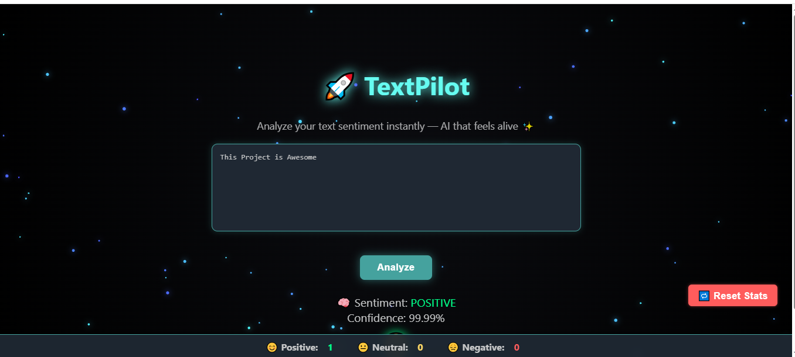

# ֎🇦🇮 TextPilot 🌌

> 🌐 *A lightweight AI microservice for real-time sentiment analysis — containerized, production-ready, and lightning fast ⚡*

[](https://www.python.org/)
[](https://flask.palletsprojects.com/)
[](https://huggingface.co/)
[](https://gunicorn.org/)
[](https://nginx.org/)
[](https://www.docker.com/)
[](LICENSE)

---

## 🖥️ Visual Demo



> Nginx-hosted Flask API performing real-time sentiment prediction powered by Hugging Face Transformers.

---

## 🏁 Quick Start

```bash
git clone https://github.com/<your-username>/TextPilot.git
cd TextPilot
docker compose up -d
```

✅ Instantly launches the **Flask API** and **Nginx reverse proxy** with one command.

---

## 🌟 Features

* 🔍 Real-time sentiment prediction (Positive / Negative / Neutral)
* ⚙️ Flask-based REST API served with Gunicorn
* 🐳 Containerized using Docker Compose
* 🚦 Health check endpoint for orchestration
* ⚡ Pre-cached Hugging Face model for faster startup
* 🔐 Nginx reverse proxy with production configuration

---

## 🧱 Tech Stack

| Layer                | Technology                                                                    |
| -------------------- | ----------------------------------------------------------------------------- |
| **Language**         | Python 3.11                                                                   |
| **Framework**        | Flask                                                                         |
| **Model**            | Hugging Face Transformers (`distilbert-base-uncased-finetuned-sst-2-english`) |
| **Server**           | Gunicorn                                                                      |
| **Proxy**            | Nginx                                                                         |
| **Containerization** | Docker & Docker Compose                                                       |

---

## 🗂️ Project Structure

```
TextPilot/
├── app/
│   ├── __init__.py
│   ├── main.py
│   ├── model.py
│   ├── wsgi.py
│   └── requirements.txt
├── nginx/
│   └── default.conf
├── Dockerfile
├── docker-compose.yml
├── .env
├── install_docker.sh
├── README.md
└── Textpilot.PNG
```

---

## ⚙️ Environment Variables

### Default values:

```
MODEL_ID=distilbert-base-uncased-finetuned-sst-2-english
TRANSFORMERS_DEVICE=-1
```

---

## 🚀 Run the Project

### 1️⃣ (Optional) Install Docker & Docker Compose

```bash
chmod +x install_docker.sh
./install_docker.sh
```

### 2️⃣ Build and Run Containers

```bash
docker compose build
docker compose up -d
```

---

## 🧩 API Endpoints

| Endpoint   | Method | Description                                 |
| ---------- | ------ | ------------------------------------------- |
| `/health`  | GET    | Health check for Docker orchestration       |
| `/analyze` | POST   | Returns sentiment prediction for input text |

### Example:

```bash
curl -s -X POST http://localhost:8080/analyze \
  -H "Content-Type: application/json" \
  -d '{"text": "TextPilot is an awesome project!"}'
```

**Expected Output:**

```json
{"label": "POSITIVE", "score": 0.9993}
```

---

## 🐳 Docker Setup Overview

| Service | Role                                                | Port |
| ------- | --------------------------------------------------- | ---- |
| `api`   | Flask app + Transformers model (served by Gunicorn) | 8000 |
| `nginx` | Reverse proxy to the Flask service                  | 80   |

Nginx handles all external traffic and routes requests internally to the Flask API.

---

## 🧰 Maintenance Commands

```bash
# Check logs
docker compose logs -f

# Restart containers
docker compose restart

# Stop services
docker compose down
```

---

## 🧠 Future Enhancements

* 🔐 Add JWT authentication
* 📊 Add Swagger/OpenAPI documentation
* 🧠 Support multiple NLP models (emotion, toxicity, etc.)
* ☁️ Deploy on AWS ECS or DigitalOcean with HTTPS

---

## 📄 License

This project is licensed under the **MIT License**.

